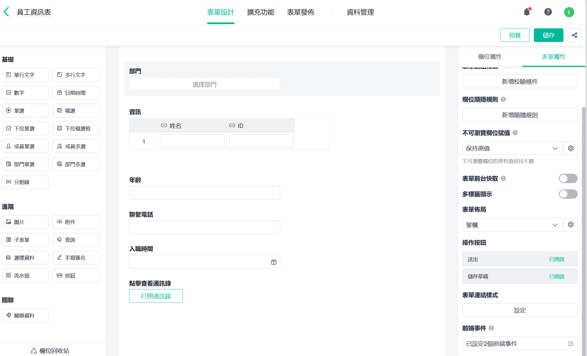

# Jodoo入门

## 一、jodoo简介

Jodoo 是一个零程式码轻量级应用搭建平台，旨在满足企业/部门的个人化管理需求。 Jodoo 拥有表单、流程、仪表板等核心功能。透过拖拉/拖曳的操作方式，让企业快速搭建出符合自身需求的管理应用。 Jodoo 的灵活使用有助于企业规范业务流程、促进团队协作、实现资料追踪。

#### 核心功能

Jodoo 拥有表单、流程、仪表板等核心功能。我们可以在在手机移动端接收 Jodoo 讯息、处理相关业务，进行资料的录入、查询、共享、分析等操作。

#### 表单工具

表单中提供丰富的表单栏位及属性，可根据业务场景及逻辑灵活定义业务规则，搭建出属于符合企业需求的应用场景：如员设备巡检、质量检验、卡片信息登记等。

