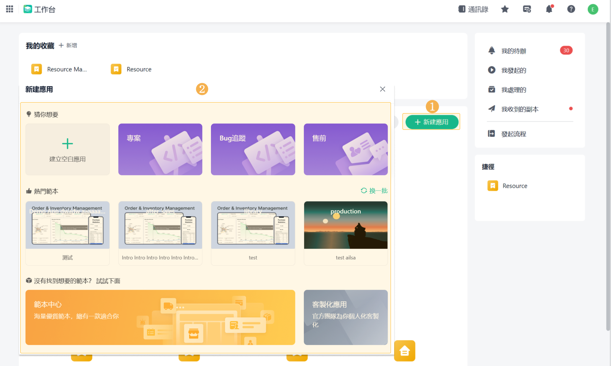
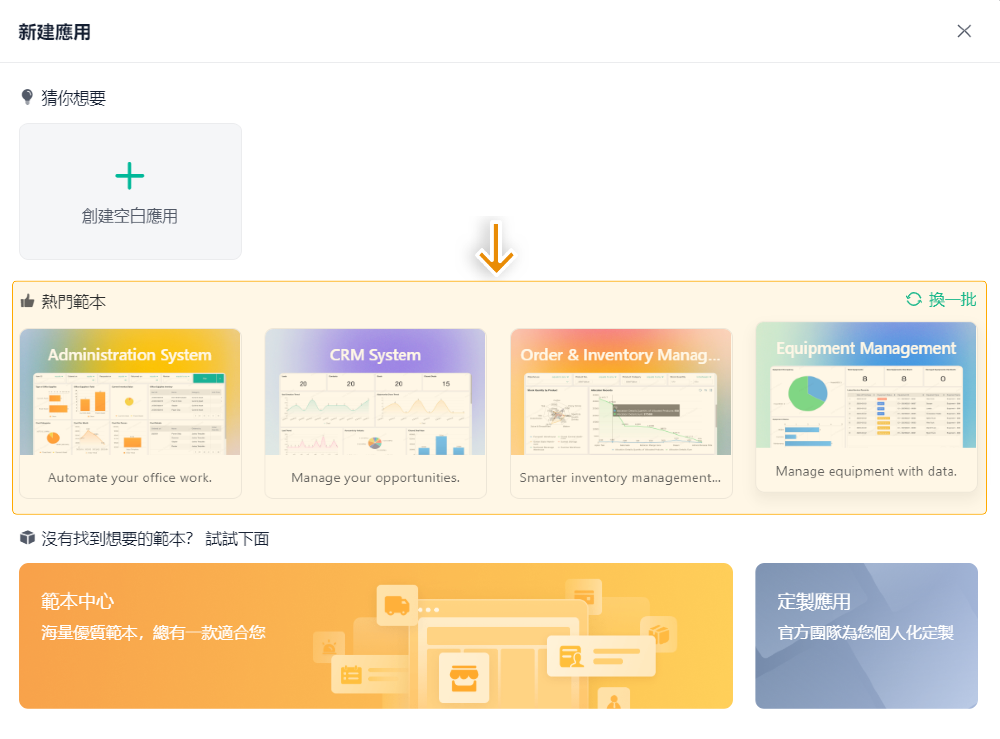
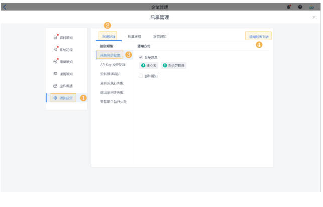

# 工作台

## 一、应用管理

### 1、建立应用：

​	一个应用是由若干张表单和仪表板组成的业务管理系统。就像一个工厂，由不同的生产线共同组成。

不同的应用可以构成大大小小不同的业务管理系统，应用与应用之间还可以相互关联。应用中可以建立：

普通表单，可以实现资料收集、协作的功能；

流程表单，可以实现流程审核功能；

仪表板，可以实现资料分析、处理以及结果展示功能。

​	进入 Jodoo 工作台 ，点击新建应用，如下图所示：

### 2、热门范本安装:

## 二、讯息管理
在 Jodoo 系统中，存在着各种各样的讯息。讯息管理就相当于一个收件箱，您可以在讯息管理中查看 Jodoo 系统使用过程中的各类讯息。所有讯息类型均保留最近六个月的讯息。
讯息管理通知设定，在「讯息管理 > 通知设定」中，支援对「系统记录」、「用量通知」、「运营通知」、「协作邀请」这四种讯息设定接收讯息的通知方式和通知对象。

## 二、讯息管理

Jodoo 的「个人设定」主要用于管理个人帐户资讯，分为三部分：基本资讯、帐号安全与帐号注销。基本资讯包含头像、通讯录姓名、使用者ID（不可修改）、昵称与语言切换；帐号安全涵盖密码修改、手机与信箱绑定/更换、登入二次验证、禁止同时登入以及 Google 帐号绑定；帐号注销则提供删除帐号功能，但一旦注销将无法恢复。